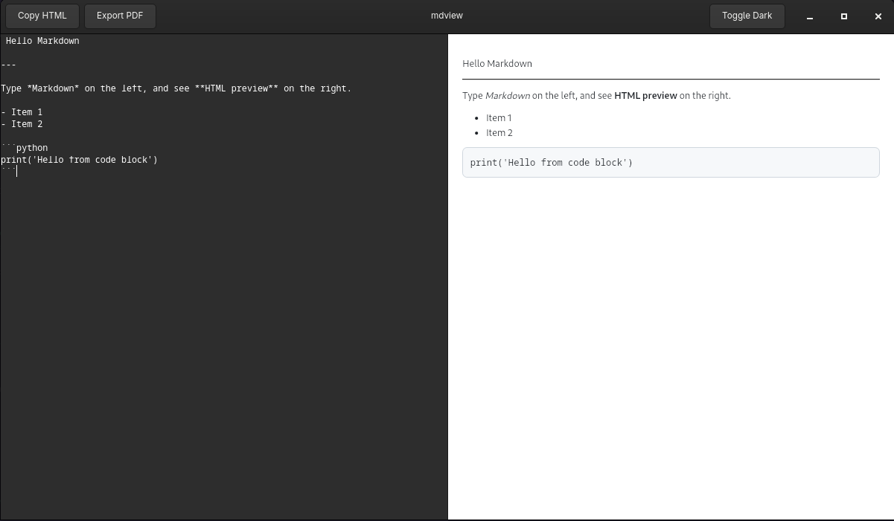
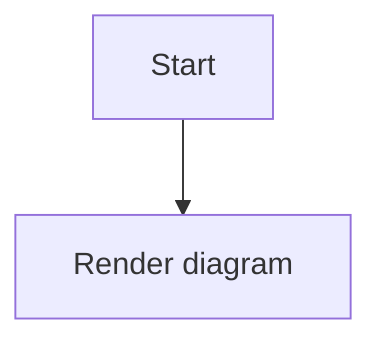

# mdview

```text
                _       _
 _ __ ___   __| |_   _(_) _____      __
| '_ ` _ \ / _` | | | | |/ _ \ \ /\ / /
| | | | | | (_| | |_| | |  __/\ V  V /
|_| |_| |_|\__,_|\__,_|_|\___| \_/\_/
```

`mdview` is a lightweight, native GTK Markdown editor with live preview.

It is designed to feel minimal and fast while staying easy to extend.

## Highlights

- Native GTK 4 application (no Electron)
- Split editor/preview layout with draggable divider
- Live rendering using Mistune (faster, plugin-based)
- Mermaid diagram rendering in preview (offline local bundle)
- Dark mode toggle for preview
- Copy rendered HTML to clipboard
- Open/save markdown files
- Clear editor button
- Export preview to PDF
- Optional sync scrolling (enabled by default)
- File/Edit/About menus with keyboard-friendly actions
- Local install script for desktop launcher + icons

## Screenshot



## Tech Stack

- Python 3
- PyGObject (`Gtk`, `Gdk`, `GLib`)
- WebKitGTK (`WebKit` introspection)
- Mistune
- Mermaid.js (bundled locally for offline rendering)

## Requirements

Core runtime:
- Python 3
- GTK 4 + WebKitGTK + PyGObject introspection bindings

Fedora/RHEL (dnf):

```bash
sudo dnf install -y python3-gobject gtk4 webkit2gtk4.1 python3-pip
```

Debian/Ubuntu (apt):

```bash
sudo apt-get update
sudo apt-get install -y python3-gi gir1.2-gtk-4.0 gir1.2-webkit-6.0 python3-pip
```

(On some distros/releases, WebKit package name may be `gir1.2-webkit2-4.1`.)

Arch (pacman):

```bash
sudo pacman -S --needed python python-gobject gtk4 webkitgtk-6.0 python-pip
```

openSUSE (zypper):

```bash
sudo zypper --non-interactive install python3-gobject-Gdk gtk4 typelib-1_0-WebKit-6_0 python3-pip
```

Python package:

```bash
python3 -m pip install --user mistune
```

If your distro Python is externally managed (PEP 668), use:

```bash
python3 -m pip install --user --break-system-packages mistune
```

## Run From Source

```bash
python3 markdown_editor.py
```

## Mermaid Support

`mdview` automatically renders fenced Mermaid blocks in the preview pane:

~~~markdown

~~~

Security posture for preview content:
- Preview is loaded with a restrictive Content Security Policy.
- No remote network requests are allowed from preview content.
- Navigation/new-window actions from preview links are blocked.
- Mermaid is loaded from a local bundled file (`assets/vendor/mermaid.min.js`).

## Install (Desktop Integration)

Install for the current user (recommended):

```bash
./install.sh
```

What it installs:

- App code: `~/.local/share/mdview/markdown_editor.py`
- App helper module: `~/.local/share/mdview/mdview_utils.py`
- Desktop file: `~/.local/share/applications/mdview.desktop`
- Icons: `~/.local/share/icons/hicolor/.../mdview.*`

After install, launch **mdview** from your Applications menu.

### Installer options

Skip dependency installation:

```bash
./install.sh --no-deps
```

## Uninstall

```bash
./uninstall.sh
```

## Release

Create and publish a GitHub release:

```bash
./release.sh
```

What it does:
- verifies clean git state
- runs `python3 -m py_compile markdown_editor.py`
- auto bumps patch version from latest `vX.Y.Z` tag
- creates annotated tag and pushes it
- creates GitHub release with generated notes
- uploads `mdview-vX.Y.Z.tar.gz` as a release asset

Useful options:

```bash
./release.sh --dry-run
./release.sh --version v1.2.0
```

## Project Layout

- `markdown_editor.py` - main GTK app
- `install.sh` - user-local installer
- `uninstall.sh` - remove installed files
- `release.sh` - version/tag/release automation
- `icons/hicolor/` - app icon assets
- `mdview.desktop` - development desktop entry template

## Roadmap

- Packaging for RPM/Flatpak
 - Unsaved-changes indicator in the window title and confirm dialog for destructive actions (Open/Clear)
 - Add an automated CI job that runs py_compile and unit tests on push
 - Add an integration test to exercise open/save and export workflows

## License

MIT (or your preferred license)
