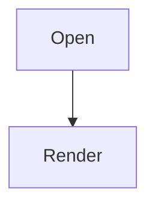
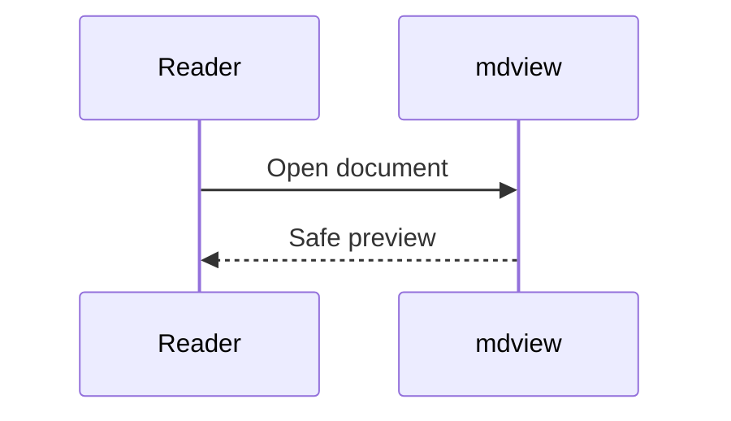
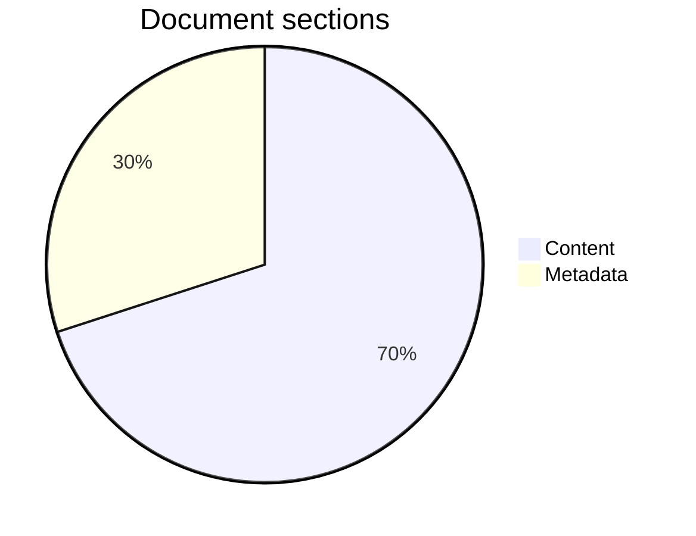
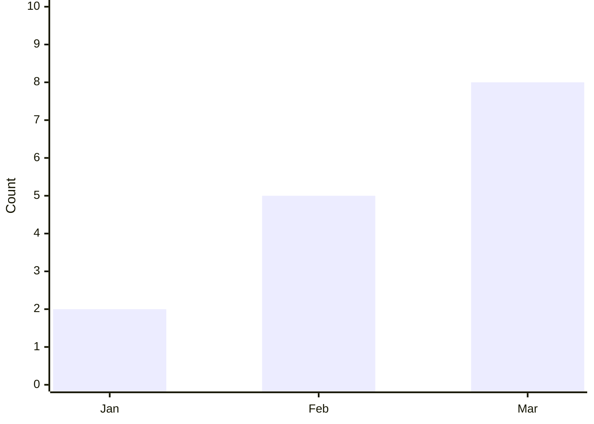
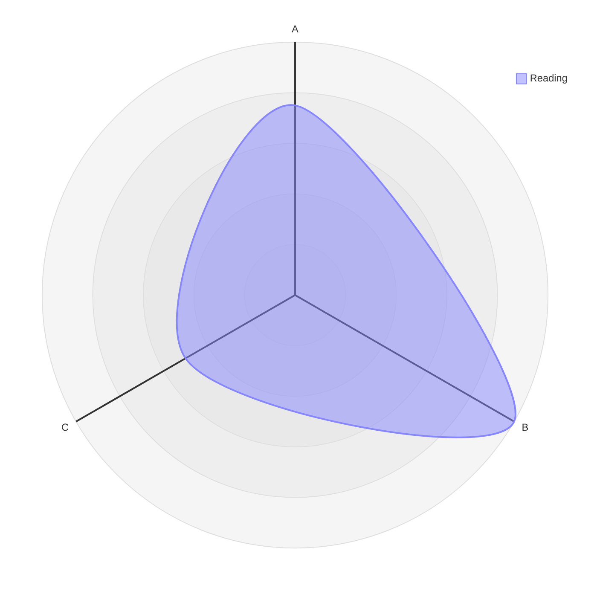
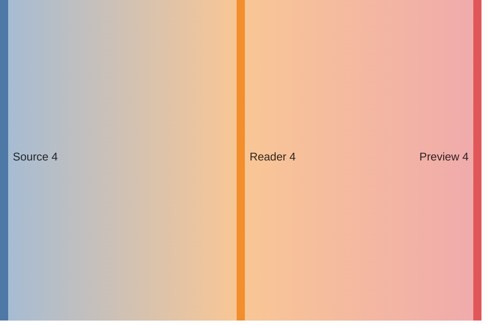

# Kitchen sink

This document combines the renderer's supported Markdown features. Its local image lives at [sample-image.svg](./assets/sample-image.svg).

## Heading two

### Heading three

#### Heading four

##### Heading five

###### Heading six

## Heading two

Duplicate headings must receive distinct stable IDs.

## Links and image

[Relative guide](./guide.md#install) and [external guide](https://example.com/guide).


## Lists and tasks

- Parent item
  - Nested item
  - [x] Completed task
  - [ ] Open task

1. Ordered item
   1. Nested ordered item

## Table

| Name | Value |
| :--- | ---: |
| narrow | 1 |
| wide content | `a-long-unbroken-value-for-overflow-checks` |

## Callouts and highlights

> [!WARNING]+ Read carefully
> Nested **Markdown** stays formatted.
> - First point
> - Second point

This ==text should be highlighted== in the preview.

## Footnotes

Footnotes keep their references and backlinks.[^source]

[^source]: A local footnote with **formatted text**.

## Math

Inline math: $x^2 + y^2 = z^2$.

$$
\sum_{n=1}^{\infty} \frac{1}{n^2} = \frac{\pi^2}{6}
$$

## Code

```ts
const answer: number = 42;
console.log(answer);
```

```language-that-does-not-exist

```

## Details

<details>
<summary>More information</summary>

This disclosure contains ordinary Markdown text.
</details>

## Mermaid diagrams and charts













## Hostile raw HTML

Before the hostile element.

<script>window.kitchenSinkAttack = true</script>


After the hostile element.
