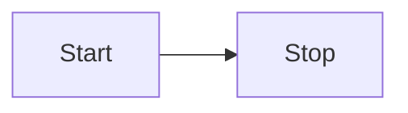
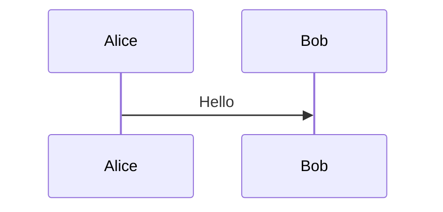
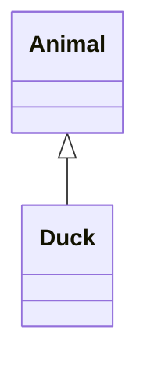
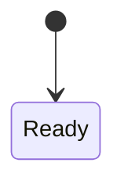
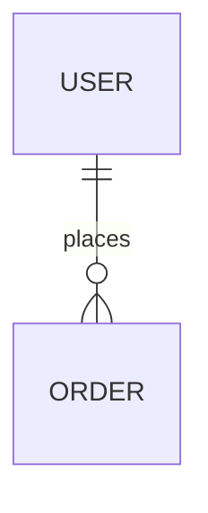
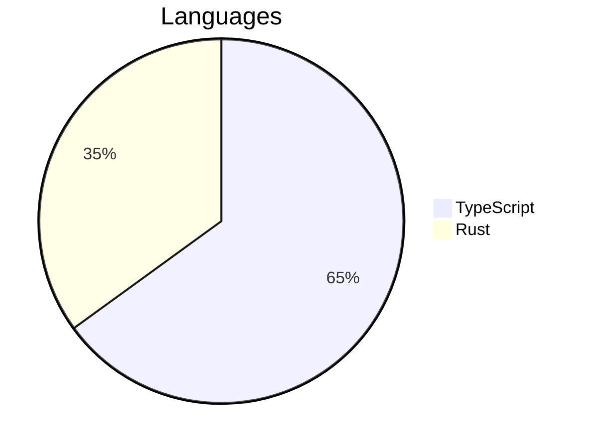
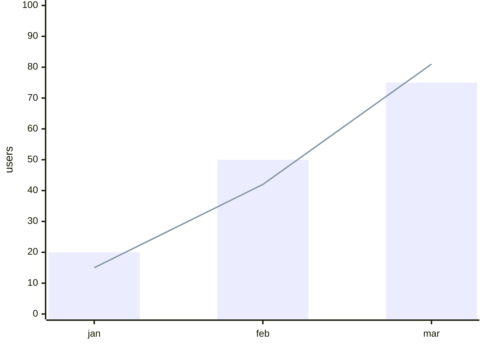
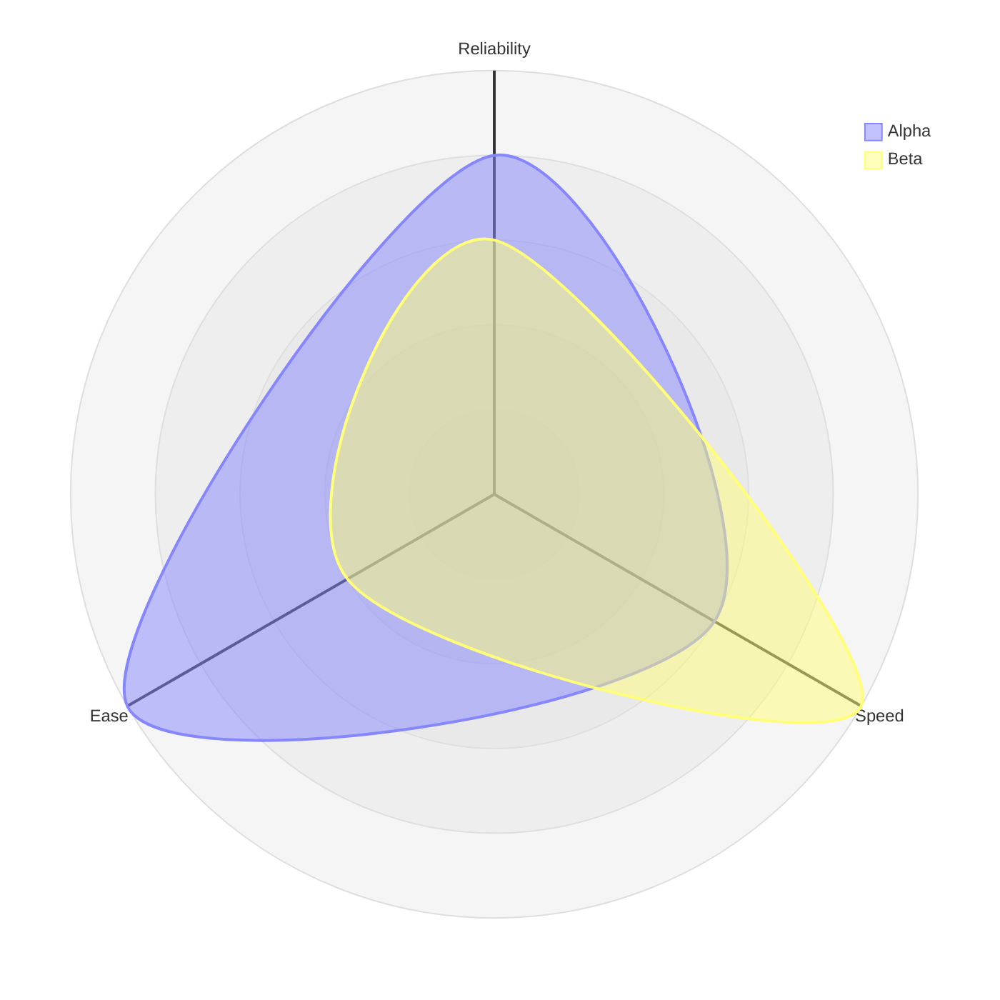
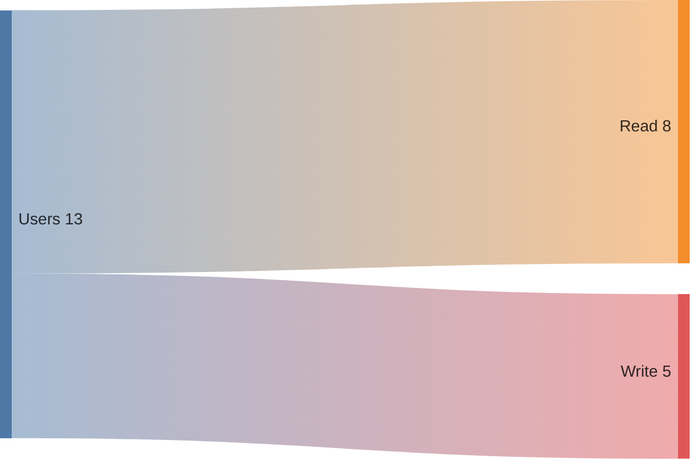

# Mermaid gallery

```mermaid
flowchart LR
  Start --> Stop
```

```mermaid
sequenceDiagram
  Alice->>Bob: Hello
```

```mermaid
classDiagram
  Animal <|-- Duck
```

```mermaid
stateDiagram-v2
  [*] --> Ready
```

```mermaid
erDiagram
  USER ||--o{ ORDER : places
```

```mermaid
pie title Languages
  "TypeScript" : 65
  "Rust" : 35
```

```mermaid
xychart-beta
  x-axis [jan, feb, mar]
  y-axis "users" 0 --> 100
  bar [20, 50, 75]
  line [15, 42, 81]
```

```mermaid
radar-beta
  axis Reliability, Speed, Ease
  curve Alpha{4, 3, 5}
  curve Beta{3, 5, 2}
```

```mermaid
sankey-beta
  Users,Read,8
  Users,Write,5
```
